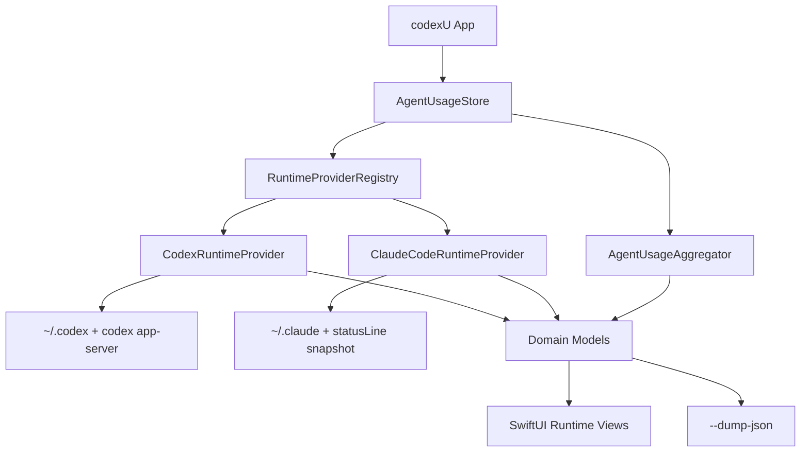
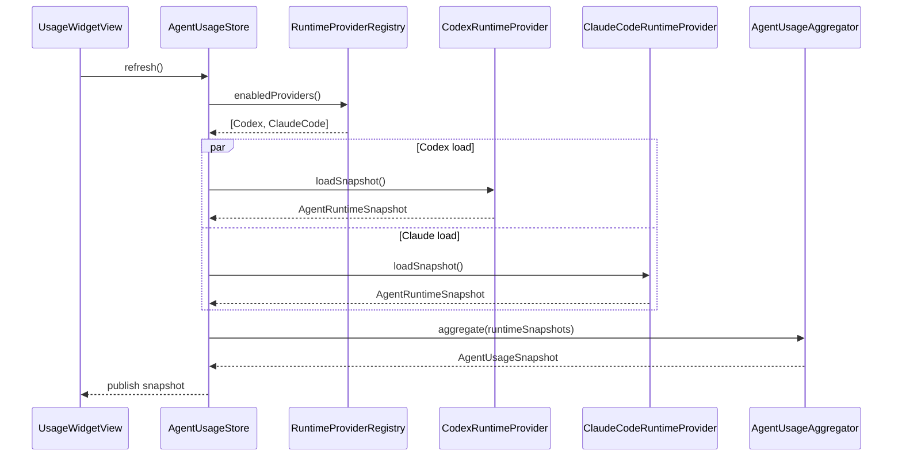
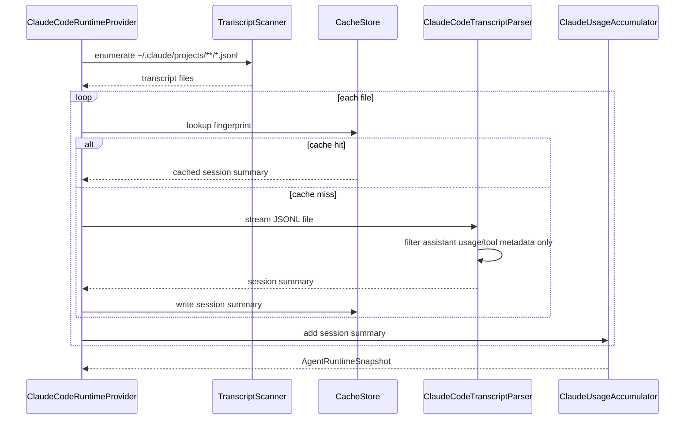
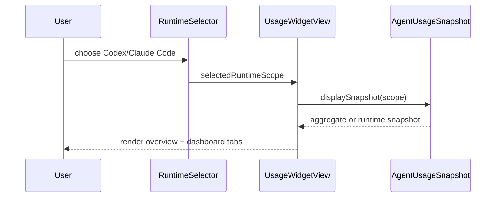
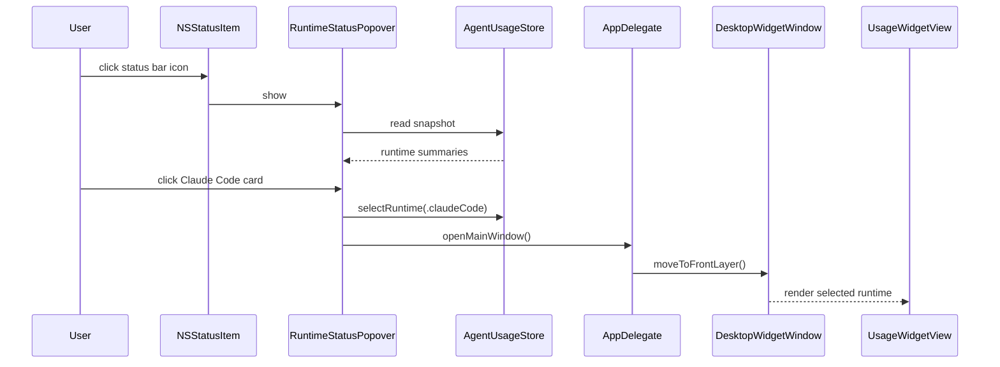

# 技术方案：多 Agent Runtime 统计架构与 Claude Code 支持

返回：[Feature-001 BRIEF](../BRIEF.md)

版本：v1.0<br>
日期：2026-07-07<br>
状态：Draft

## 1. 概述

### 1.1 目标与约束

本 Feature 的目标是把 codexU 从单一 Codex 数据读取器重构为多 Agent Runtime 统计框架，并在该框架下新增 Claude Code 支持。重构后的系统需要做到：Codex 与 Claude Code 的文件/API 读取互相独立，公共 UI 只依赖标准化用量模型，聚合层可以合并跨 Runtime 的 token、价值、趋势、项目、工具和 Skill 统计。

当前项目是轻量 macOS SwiftUI 应用，构建方式由 `Makefile` 直接调用 `swiftc`，现有 `SOURCES` 只包含 `Sources/CodexUsageWidget/main.swift`。因此本次架构调整必须先改造源码组织与编译入口，再逐步迁移现有 6000 行单文件实现，避免新增 Claude Code 后继续扩大单文件耦合。

技术约束：

- macOS 14+，继续使用 Cocoa、Carbon、SwiftUI，不引入新包管理或第三方依赖。
- 所有数据本地读取，不上传，不读取认证 token 值。
- Provider 私有 parser 不能依赖 SwiftUI 类型；SwiftUI 不能读取 provider 私有路径或 JSON key。
- 缺失数据必须显式标记不可用或本地记录不足，不能伪造为 0。
- Claude Code transcript 是明文文件，parser 必须只抽取结构化 metadata 和 usage 字段。
- 架构拆分不能破坏现有 Codex 功能和 `--dump-json` 兼容输出。

### 1.2 涉及系统与模块

| 应用/包 | 涉及模块 | 变更类型 |
| --- | --- | --- |
| codexU macOS app | `/Users/guomeiqing/Documents/New project 2/codex-usage-widget/Makefile` | 修改 |
| codexU macOS app | `/Users/guomeiqing/Documents/New project 2/codex-usage-widget/Sources/CodexUsageWidget/main.swift` | 拆分/瘦身 |
| codexU macOS app | `/Users/guomeiqing/Documents/New project 2/codex-usage-widget/Sources/CodexUsageWidget/App/` | 新增 |
| codexU macOS app | `/Users/guomeiqing/Documents/New project 2/codex-usage-widget/Sources/CodexUsageWidget/Domain/` | 新增 |
| codexU macOS app | `/Users/guomeiqing/Documents/New project 2/codex-usage-widget/Sources/CodexUsageWidget/Providers/Codex/` | 新增 |
| codexU macOS app | `/Users/guomeiqing/Documents/New project 2/codex-usage-widget/Sources/CodexUsageWidget/Providers/ClaudeCode/` | 新增 |
| codexU macOS app | `/Users/guomeiqing/Documents/New project 2/codex-usage-widget/Sources/CodexUsageWidget/Services/` | 新增 |
| codexU macOS app | `/Users/guomeiqing/Documents/New project 2/codex-usage-widget/Sources/CodexUsageWidget/UI/` | 新增 |
| codexU macOS app | `/Users/guomeiqing/Documents/New project 2/codex-usage-widget/Sources/CodexUsageWidget/UI/StatusBarMenu.swift` | 新增 |
| codexU macOS app | `/Users/guomeiqing/Documents/New project 2/codex-usage-widget/Sources/CodexUsageWidget/UI/RuntimeSelector.swift` | 新增 |
| codexU docs | `/Users/guomeiqing/Documents/New project 2/codex-usage-widget/README.md` | 修改 |
| codexU docs | `/Users/guomeiqing/Documents/New project 2/codex-usage-widget/README.en.md` | 修改 |
| codexU docs | `/Users/guomeiqing/Documents/New project 2/codex-usage-widget/RESEARCH.md` | 修改 |
| codexU docs | `/Users/guomeiqing/Documents/New project 2/codex-usage-widget/SECURITY.md` | 修改 |

## 2. 系统设计

### 2.1 架构变更

变更后采用四层结构：

- App 层：macOS window、hotkey、status item、应用生命周期。
- Domain 层：统一 Agent Runtime 用量模型、协议、聚合模型。
- Provider 层：Codex、Claude Code 各自解析本地数据源并输出标准化 snapshot。
- UI 层：只消费 `AgentUsageSnapshot`，不直接接触 `~/.codex`、`~/.claude`、SQLite 或 JSONL。



建议目录结构：

```text
Sources/CodexUsageWidget/
├── App/
│   ├── codexUMain.swift
│   ├── AppDelegate.swift
│   ├── DesktopWidgetWindow.swift
│   └── WindowPresentationState.swift
├── Domain/
│   ├── AgentRuntime.swift
│   ├── AgentUsageSnapshot.swift
│   ├── UsageModels.swift
│   ├── TaskModels.swift
│   ├── Diagnostics.swift
│   └── Pricing.swift
├── Providers/
│   ├── RuntimeProvider.swift
│   ├── Codex/
│   │   ├── CodexRuntimeProvider.swift
│   │   ├── CodexAppServerClient.swift
│   │   ├── CodexSQLiteReader.swift
│   │   ├── CodexSessionParser.swift
│   │   └── CodexTaskReader.swift
│   └── ClaudeCode/
│       ├── ClaudeCodeRuntimeProvider.swift
│       ├── ClaudeCodeTranscriptParser.swift
│       ├── ClaudeCodeStatsCacheReader.swift
│       ├── ClaudeCodeTaskReader.swift
│       ├── ClaudeCodeStatusLineSnapshotReader.swift
│       └── ClaudeCodeGlobalStateReader.swift
├── Services/
│   ├── AgentUsageStore.swift
│   ├── RuntimeProviderRegistry.swift
│   ├── AgentUsageAggregator.swift
│   ├── CacheStore.swift
│   ├── JSONDumpWriter.swift
│   └── FileFingerprint.swift
├── UI/
│   ├── UsageWidgetView.swift
│   ├── RuntimeSelector.swift
│   ├── StatusBarMenu.swift
│   ├── RuntimeSummaryCard.swift
│   ├── OverviewSection.swift
│   ├── DashboardTabs.swift
│   ├── UsageTrendPanel.swift
│   ├── ProjectBoardPanel.swift
│   ├── SkillUsagePanel.swift
│   ├── TaskBoardPanel.swift
│   ├── Components.swift
│   └── WidgetPalette.swift
└── Shared/
    ├── Formatting.swift
    ├── Localization.swift
    └── ParsingHelpers.swift
```

### 2.2 核心流程

#### 2.2.1 全量刷新



#### 2.2.2 Claude Code JSONL 解析



#### 2.2.3 Runtime 切换渲染



#### 2.2.4 状态栏菜单点击进入主界面



### 2.3 关键接口与 Good Smell 约束

#### Runtime Provider 协议

```swift
protocol RuntimeUsageProvider {
    var runtime: AgentRuntimeDescriptor { get }
    func loadSnapshot(context: RuntimeLoadContext) -> AgentRuntimeSnapshot
    func loadTaskBoard(context: RuntimeLoadContext) -> RuntimeTaskBoard?
}
```

约束：

- `loadSnapshot` 不抛异常，错误进入 `diagnostics`。
- Provider 只能返回标准化模型，不能返回 raw JSON、SQLite row 或 provider 私有 DTO。
- Provider 私有 DTO 用 `private struct` 放在 provider 目录内。
- Provider 不引用 SwiftUI、Color、View、NSImage。

#### Store 与 Aggregator

```swift
final class AgentUsageStore: ObservableObject {
    @Published var snapshot: AgentUsageSnapshot
    @Published var isRefreshing: Bool
    @Published var selectedRuntimeScope: RuntimeScope
}

struct AgentUsageAggregator {
    func aggregate(_ runtimes: [AgentRuntimeSnapshot], at refreshedAt: Date) -> AgentUsageAggregate
}
```

约束：

- Store 只负责编排刷新和发布状态，不解析文件。
- Store 持有当前 Runtime 选择，状态栏菜单和主界面顶部开关必须写入同一个 `selectedRuntimeScope`。
- Aggregator 不读文件，不知道 provider 私有路径。
- Aggregator 只合并可比指标；额度窗口不跨 Runtime 做百分比相加。

## 3. 数据设计

### 3.1 数据模型变更

项目本身不拥有数据库，不新增 DDL。Codex 的 SQLite 是外部本地状态库，只读访问；Claude Code 的 JSONL 和 JSON 状态文件也是只读访问。本 Feature 的数据设计重点是 Swift Domain Model 与本地 cache JSON。

核心 Swift 模型：

```swift
enum AgentRuntimeKind: String, Codable {
    case codex
    case claudeCode
}

struct AgentRuntimeDescriptor: Identifiable, Codable, Equatable {
    let id: String
    let kind: AgentRuntimeKind
    let displayName: String
    let isEnabled: Bool
}

struct AgentUsageSnapshot: Codable, Equatable {
    let refreshedAt: Date
    let aggregate: AgentUsageAggregate
    let runtimes: [AgentRuntimeSnapshot]
    let diagnostics: [RuntimeDiagnostic]
}

enum RuntimeScope: String, Codable, Equatable, CaseIterable {
    case codex
    case claudeCode
}

struct AgentRuntimeSnapshot: Identifiable, Codable, Equatable {
    let id: String
    let runtime: AgentRuntimeDescriptor
    let account: RuntimeAccount?
    let quota: RuntimeQuota?
    let localUsage: RuntimeLocalUsage?
    let taskBoard: RuntimeTaskBoard?
    let capabilities: RuntimeCapabilities
    let diagnostics: [RuntimeDiagnostic]
}

struct RuntimeTokenBreakdown: Codable, Equatable {
    var inputTokens: Int64
    var uncachedInputTokens: Int64
    var cacheCreationInputTokens: Int64
    var cacheReadInputTokens: Int64
    var outputTokens: Int64
    var reasoningOutputTokens: Int64
    var totalTokens: Int64
}

struct RuntimeMenuSummary: Codable, Equatable {
    let runtimeId: String
    let displayName: String
    let status: RuntimeMenuStatus
    let fiveHourRemainingPercent: Double?
    let fiveHourResetsAt: Date?
    let sevenDayRemainingPercent: Double?
    let sevenDayResetsAt: Date?
    let todayTokens: Int64?
    let sourceLabel: String
}
```

兼容策略：

- 现有 `TokenBreakdown` 可先扩展为支持 `cacheCreationInputTokens` 与 `cacheReadInputTokens`，再 typealias 或迁移为 `RuntimeTokenBreakdown`。
- Codex provider 将原 `cachedInputTokens` 映射到 `cacheReadInputTokens`，`cacheCreationInputTokens` 为 0。
- Claude Code provider 将 `cache_creation_input_tokens` 映射到 `cacheCreationInputTokens`，`cache_read_input_tokens` 映射到 `cacheReadInputTokens`。

### 3.2 本地 cache schema

缓存路径仍使用用户缓存目录下的 `codexU`，按 provider 分离：

```text
~/Library/Caches/codexU/codex/local-analytics-v3.json
~/Library/Caches/codexU/codex/session-usage-v2.json
~/Library/Caches/codexU/claude-code/local-analytics-v1.json
~/Library/Caches/codexU/claude-code/session-usage-v1.json
~/Library/Caches/codexU/claude-code/statusline-snapshot.json
```

Claude Code session cache:

```json
{
  "version": 1,
  "entries": {
    "/Users/name/.claude/projects/project/session.jsonl": {
      "fileSize": 12345,
      "modificationDate": "2026-07-07T00:00:00Z",
      "sessionId": "uuid",
      "projectPath": "/Users/name/work/repo",
      "modelUsages": {},
      "deltas": [],
      "toolCalls": {},
      "skillLoads": [],
      "taskRefs": []
    }
  }
}
```

### 3.3 迁移方案

- 阶段 1 保留旧 Codex cache 文件可读，新 Codex provider cache 使用新路径；无法读取旧 cache 时重新解析，不做复杂迁移。
- 阶段 2 `--dump-json` 同时输出旧字段和新 `runtimes`/`aggregate` 字段。
- 阶段 3 后续版本再移除旧 dump 字段，需另行发布说明。
- 回滚方式：保留 `main.swift` 迁移前行为的 git diff，可恢复 Makefile `SOURCES := Sources/CodexUsageWidget/main.swift` 和旧 `CodexUsageReader`。

## 4. API 设计

### 4.1 接口清单

本项目没有 HTTP API。本 Feature 的接口包括内部 Swift 协议、CLI dump JSON 和可选 statusLine snapshot 文件。

| 方法 | 路径/接口 | 描述 | 请求体 | 响应体 |
| --- | --- | --- | --- | --- |
| Swift | `RuntimeUsageProvider.loadSnapshot(context:)` | Provider 全量读取 | `RuntimeLoadContext` | `AgentRuntimeSnapshot` |
| Swift | `RuntimeUsageProvider.loadTaskBoard(context:)` | Provider 高频任务读取 | `RuntimeLoadContext` | `RuntimeTaskBoard?` |
| Swift | `AgentUsageAggregator.aggregate(_:,at:)` | 跨 Runtime 聚合 | `[AgentRuntimeSnapshot]` | `AgentUsageAggregate` |
| Swift | `AgentUsageStore.selectRuntime(_:)` | 状态栏菜单和主界面 Runtime 开关共用选择入口 | `RuntimeScope` | 无 |
| Swift | `RuntimeMenuSummaryBuilder.makeSummaries(snapshot:)` | 生成状态栏 Runtime 卡片数据 | `AgentUsageSnapshot` | `[RuntimeMenuSummary]` |
| CLI | `build/codexU.app/Contents/MacOS/codexU --dump-json` | 输出调试 JSON | 无 | runtime-aware JSON |
| File | `~/Library/Caches/codexU/claude-code/statusline-snapshot.json` | Claude Code active 快照 | Claude statusLine script 写入 | `ClaudeCodeStatusLineSnapshot` |

### 4.2 `--dump-json` 响应结构

新增结构：

```json
{
  "schemaVersion": 2,
  "refreshedAt": "2026-07-07T00:00:00Z",
  "aggregate": {
    "detailedUsage": {},
    "usageTrend": {},
    "projectBoard": {},
    "toolUsages": [],
    "skillUsages": []
  },
  "runtimes": [
    {
      "id": "codex",
      "displayName": "Codex",
      "account": {},
      "quota": {},
      "local": {},
      "taskBoard": {},
      "diagnostics": []
    },
    {
      "id": "claude-code",
      "displayName": "Claude Code",
      "account": {},
      "quota": null,
      "local": {},
      "taskBoard": {},
      "diagnostics": []
    }
  ],
  "compat": {
    "codex": {
      "account": {},
      "primary": {},
      "secondary": {},
      "local": {},
      "taskBoard": {}
    }
  }
}
```

兼容要求：

- 首版保留旧 top-level `account`、`primary`、`secondary`、`local`、`taskBoard` 字段，内容来自 Codex runtime。
- 新消费者优先使用 `schemaVersion = 2` 的 `aggregate` 和 `runtimes`。

### 4.3 statusLine snapshot schema

```json
{
  "schemaVersion": 1,
  "capturedAt": "2026-07-07T00:00:00Z",
  "sessionId": "uuid",
  "model": {
    "id": "claude-opus-4-8",
    "displayName": "Opus"
  },
  "cost": {
    "totalCostUSD": 0.01234,
    "totalDurationMs": 45000,
    "totalApiDurationMs": 2300,
    "totalLinesAdded": 156,
    "totalLinesRemoved": 23
  },
  "contextWindow": {
    "totalInputTokens": 15500,
    "totalOutputTokens": 1200,
    "contextWindowSize": 200000,
    "usedPercentage": 8,
    "remainingPercentage": 92
  },
  "rateLimits": {
    "fiveHour": {
      "usedPercentage": 23.5,
      "resetsAt": 1738425600
    },
    "sevenDay": {
      "usedPercentage": 41.2,
      "resetsAt": 1738857600
    }
  },
  "workspace": {
    "currentDir": "/path/to/project",
    "projectDir": "/path/to/project",
    "gitBranch": "main"
  }
}
```

读取规则：

- `capturedAt` 超过 15 分钟标记 stale。
- 缺少 `rateLimits` 不影响 context/cost 展示。
- 首版不自动写这个文件；只提供 reader 和文档示例。

## 5. 实现计划

### 5.1 任务拆解

| 序号 | 任务 | 涉及目录/文件 | 预估工时 | 依赖 |
| ---- | ---- | ------------- | -------- | ---- |
| 1 | 改造 Makefile，使所有 Swift 文件参与编译 | `/Users/guomeiqing/Documents/New project 2/codex-usage-widget/Makefile` | 0.25d | 无 |
| 2 | 创建目录结构与迁移 App 入口/window/hotkey 代码 | `/Users/guomeiqing/Documents/New project 2/codex-usage-widget/Sources/CodexUsageWidget/App/codexUMain.swift`<br>`/Users/guomeiqing/Documents/New project 2/codex-usage-widget/Sources/CodexUsageWidget/App/AppDelegate.swift`<br>`/Users/guomeiqing/Documents/New project 2/codex-usage-widget/Sources/CodexUsageWidget/App/DesktopWidgetWindow.swift`<br>`/Users/guomeiqing/Documents/New project 2/codex-usage-widget/Sources/CodexUsageWidget/main.swift` | 0.75d | 1 |
| 3 | 抽取公共 Domain 模型并保持 Codex 兼容 | `/Users/guomeiqing/Documents/New project 2/codex-usage-widget/Sources/CodexUsageWidget/Domain/AgentRuntime.swift`<br>`/Users/guomeiqing/Documents/New project 2/codex-usage-widget/Sources/CodexUsageWidget/Domain/AgentUsageSnapshot.swift`<br>`/Users/guomeiqing/Documents/New project 2/codex-usage-widget/Sources/CodexUsageWidget/Domain/UsageModels.swift`<br>`/Users/guomeiqing/Documents/New project 2/codex-usage-widget/Sources/CodexUsageWidget/Domain/TaskModels.swift`<br>`/Users/guomeiqing/Documents/New project 2/codex-usage-widget/Sources/CodexUsageWidget/Domain/Diagnostics.swift` | 1d | 1 |
| 4 | 抽取价格、格式化、解析和文件 fingerprint helper | `/Users/guomeiqing/Documents/New project 2/codex-usage-widget/Sources/CodexUsageWidget/Domain/Pricing.swift`<br>`/Users/guomeiqing/Documents/New project 2/codex-usage-widget/Sources/CodexUsageWidget/Shared/Formatting.swift`<br>`/Users/guomeiqing/Documents/New project 2/codex-usage-widget/Sources/CodexUsageWidget/Shared/Localization.swift`<br>`/Users/guomeiqing/Documents/New project 2/codex-usage-widget/Sources/CodexUsageWidget/Shared/ParsingHelpers.swift`<br>`/Users/guomeiqing/Documents/New project 2/codex-usage-widget/Sources/CodexUsageWidget/Services/FileFingerprint.swift` | 0.75d | 3 |
| 5 | 定义 Provider 协议、Registry、Store、Aggregator | `/Users/guomeiqing/Documents/New project 2/codex-usage-widget/Sources/CodexUsageWidget/Providers/RuntimeProvider.swift`<br>`/Users/guomeiqing/Documents/New project 2/codex-usage-widget/Sources/CodexUsageWidget/Services/RuntimeProviderRegistry.swift`<br>`/Users/guomeiqing/Documents/New project 2/codex-usage-widget/Sources/CodexUsageWidget/Services/AgentUsageStore.swift`<br>`/Users/guomeiqing/Documents/New project 2/codex-usage-widget/Sources/CodexUsageWidget/Services/AgentUsageAggregator.swift` | 1d | 3,4 |
| 6 | 迁移 Codex app-server 与 SQLite 读取 | `/Users/guomeiqing/Documents/New project 2/codex-usage-widget/Sources/CodexUsageWidget/Providers/Codex/CodexRuntimeProvider.swift`<br>`/Users/guomeiqing/Documents/New project 2/codex-usage-widget/Sources/CodexUsageWidget/Providers/Codex/CodexAppServerClient.swift`<br>`/Users/guomeiqing/Documents/New project 2/codex-usage-widget/Sources/CodexUsageWidget/Providers/Codex/CodexSQLiteReader.swift` | 1d | 5 |
| 7 | 迁移 Codex session parser、analytics cache、task reader | `/Users/guomeiqing/Documents/New project 2/codex-usage-widget/Sources/CodexUsageWidget/Providers/Codex/CodexSessionParser.swift`<br>`/Users/guomeiqing/Documents/New project 2/codex-usage-widget/Sources/CodexUsageWidget/Providers/Codex/CodexTaskReader.swift`<br>`/Users/guomeiqing/Documents/New project 2/codex-usage-widget/Sources/CodexUsageWidget/Services/CacheStore.swift` | 1d | 5,6 |
| 8 | 实现 Claude Code transcript scanner/parser 与 session cache | `/Users/guomeiqing/Documents/New project 2/codex-usage-widget/Sources/CodexUsageWidget/Providers/ClaudeCode/ClaudeCodeRuntimeProvider.swift`<br>`/Users/guomeiqing/Documents/New project 2/codex-usage-widget/Sources/CodexUsageWidget/Providers/ClaudeCode/ClaudeCodeTranscriptParser.swift` | 1d | 5 |
| 9 | 实现 Claude Code stats-cache、global state、task reader | `/Users/guomeiqing/Documents/New project 2/codex-usage-widget/Sources/CodexUsageWidget/Providers/ClaudeCode/ClaudeCodeStatsCacheReader.swift`<br>`/Users/guomeiqing/Documents/New project 2/codex-usage-widget/Sources/CodexUsageWidget/Providers/ClaudeCode/ClaudeCodeGlobalStateReader.swift`<br>`/Users/guomeiqing/Documents/New project 2/codex-usage-widget/Sources/CodexUsageWidget/Providers/ClaudeCode/ClaudeCodeTaskReader.swift` | 0.75d | 8 |
| 10 | 实现 Claude Code statusLine snapshot reader 和 stale 诊断 | `/Users/guomeiqing/Documents/New project 2/codex-usage-widget/Sources/CodexUsageWidget/Providers/ClaudeCode/ClaudeCodeStatusLineSnapshotReader.swift` | 0.5d | 8 |
| 11 | 实现状态栏菜单、Runtime 摘要卡片和卡片点击入口 | `/Users/guomeiqing/Documents/New project 2/codex-usage-widget/Sources/CodexUsageWidget/UI/StatusBarMenu.swift`<br>`/Users/guomeiqing/Documents/New project 2/codex-usage-widget/Sources/CodexUsageWidget/UI/RuntimeSummaryCard.swift`<br>`/Users/guomeiqing/Documents/New project 2/codex-usage-widget/Sources/CodexUsageWidget/App/AppDelegate.swift`<br>`/Users/guomeiqing/Documents/New project 2/codex-usage-widget/Sources/CodexUsageWidget/Services/RuntimeMenuSummaryBuilder.swift` | 1d | 5,7,8,10 |
| 12 | 拆分 SwiftUI 视图并接入主界面 Runtime selector | `/Users/guomeiqing/Documents/New project 2/codex-usage-widget/Sources/CodexUsageWidget/UI/UsageWidgetView.swift`<br>`/Users/guomeiqing/Documents/New project 2/codex-usage-widget/Sources/CodexUsageWidget/UI/RuntimeSelector.swift`<br>`/Users/guomeiqing/Documents/New project 2/codex-usage-widget/Sources/CodexUsageWidget/UI/OverviewSection.swift`<br>`/Users/guomeiqing/Documents/New project 2/codex-usage-widget/Sources/CodexUsageWidget/UI/DashboardTabs.swift` | 1d | 5,7,8,11 |
| 13 | 迁移 dashboard 面板到 runtime-aware 模型 | `/Users/guomeiqing/Documents/New project 2/codex-usage-widget/Sources/CodexUsageWidget/UI/UsageTrendPanel.swift`<br>`/Users/guomeiqing/Documents/New project 2/codex-usage-widget/Sources/CodexUsageWidget/UI/ProjectBoardPanel.swift`<br>`/Users/guomeiqing/Documents/New project 2/codex-usage-widget/Sources/CodexUsageWidget/UI/SkillUsagePanel.swift`<br>`/Users/guomeiqing/Documents/New project 2/codex-usage-widget/Sources/CodexUsageWidget/UI/TaskBoardPanel.swift` | 1d | 12 |
| 14 | 实现 runtime-aware dump JSON 与兼容输出 | `/Users/guomeiqing/Documents/New project 2/codex-usage-widget/Sources/CodexUsageWidget/Services/JSONDumpWriter.swift`<br>`/Users/guomeiqing/Documents/New project 2/codex-usage-widget/Sources/CodexUsageWidget/App/codexUMain.swift` | 0.5d | 5,7,8 |
| 15 | 更新产品、安全和研究文档 | `/Users/guomeiqing/Documents/New project 2/codex-usage-widget/README.md`<br>`/Users/guomeiqing/Documents/New project 2/codex-usage-widget/README.en.md`<br>`/Users/guomeiqing/Documents/New project 2/codex-usage-widget/RESEARCH.md`<br>`/Users/guomeiqing/Documents/New project 2/codex-usage-widget/SECURITY.md` | 0.5d | 8,10,11,14 |
| 16 | 增加轻量测试脚本和 fixture，覆盖 parser/aggregator | `/Users/guomeiqing/Documents/New project 2/codex-usage-widget/tests/fixtures/claude-code-session.jsonl`<br>`/Users/guomeiqing/Documents/New project 2/codex-usage-widget/tests/fixtures/codex-session.jsonl`<br>`/Users/guomeiqing/Documents/New project 2/codex-usage-widget/scripts/test-parsers.sh` | 0.75d | 7,8,14 |
| 17 | 端到端验证并清理 `main.swift` 剩余代码 | `/Users/guomeiqing/Documents/New project 2/codex-usage-widget/Sources/CodexUsageWidget/main.swift`<br>`/Users/guomeiqing/Documents/New project 2/codex-usage-widget/Makefile` | 0.5d | 1-16 |

### 5.2 风险点

| 风险 | 影响 | 缓解措施 |
| --- | --- | --- |
| 单次拆分 6000 行主文件容易引入行为回归 | Codex 现有功能不可用 | 先抽 Domain/Store/Provider 壳，Codex provider 迁移后立即跑 `make probe` 对比 dump |
| Makefile 多文件编译顺序或 shell glob 不稳定 | 构建失败 | 使用 `find Sources/CodexUsageWidget -name '*.swift' | sort` 生成 `SOURCES` |
| Claude Code JSONL transcript 包含敏感正文 | 隐私风险 | parser 只匹配 usage/tool metadata key，不保存 content text |
| Claude Code schema 随版本变化 | 解析失败 | 允许字段缺失，记录 diagnostics；fixture 覆盖常见 shape |
| 跨 Runtime 额度不可比 | UI 误导 | 主界面只在 Codex/Claude Code 间切换；状态栏只合并今日 token，不合并 quota |
| 状态栏菜单点击与主界面开关使用不同状态 | 入口行为不一致 | 两处统一调用 `AgentUsageStore.selectRuntime(_:)` |
| 第三方模型价格未知 | 估算价值误导 | token 正常展示，cost 显示不可用或使用用户配置价格 |
| 大量 JSONL 解析慢 | UI 刷新卡顿 | session fingerprint cache + streaming parser + 后台队列 |

## 6. 测试策略

### 6.1 单元级验证

当前项目没有正式 Swift test target。首版建议增加脚本级 fixture 验证，后续若引入 SwiftPM 再迁移到 XCTest。

覆盖范围：

- `ClaudeCodeTranscriptParser`：usage 字段、tool_use 名称、Skill attribution、损坏 JSON 行。
- `CodexSessionParser`：`token_count` delta、tool call、Skill 路径提取。
- `AgentUsageAggregator`：多 Runtime token/value/trend 合并，quota 不合并。
- `RuntimeMenuSummaryBuilder`：Codex/Claude Code 卡片字段、缺失额度和今日总 token。
- `JSONDumpWriter`：schemaVersion 2、runtimes、aggregate、compat 字段存在。

### 6.2 集成验证

命令：

```sh
make build
make probe
build/codexU.app/Contents/MacOS/codexU --dump-json
git diff --check
```

验证点：

- 无 Claude Code 数据时，Codex 功能仍可正常显示。
- 有 Claude Code 数据时，`runtimes` 包含 `codex` 和 `claude-code`。
- Claude Code 缺少 statusLine snapshot 时，quota diagnostics 正常出现。
- README/SECURITY 数据源说明与实际读取路径一致。

### 6.3 UI 验证

- Codex/Claude Code runtime selector 切换不改变 tab 布局高度。
- 点击状态栏图标先展示 Runtime 菜单，不直接打开主窗口。
- 点击 Codex/Claude Code 卡片后，主窗口打开且顶部 Runtime selector 与点击卡片一致。
- Codex 旧视图信息密度不下降。
- Claude Code 空状态文案不暗示官方账单或全局额度。
- 工具、Skill、项目列表不显示 prompt、tool arguments 或正文。

## 7. 变更记录

| 日期 | 版本 | 变更内容 | 作者 |
| ---- | ---- | -------- | ---- |
| 2026-07-07 | v1.1 | v0.4.0 实现采用渐进式兼容桥：先改 Makefile 接入多文件编译，新增 Domain/Provider/Service/UI 模块承载多 Runtime 与 Claude Code；现有 Codex reader 和主面板视图暂保留为兼容实现，通过 runtime wrapper 接入，降低 Codex 回归风险。 | Codex |
| 2026-07-07 | v1.0 | 初稿 | Codex |
