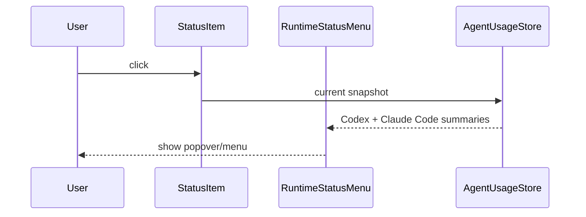
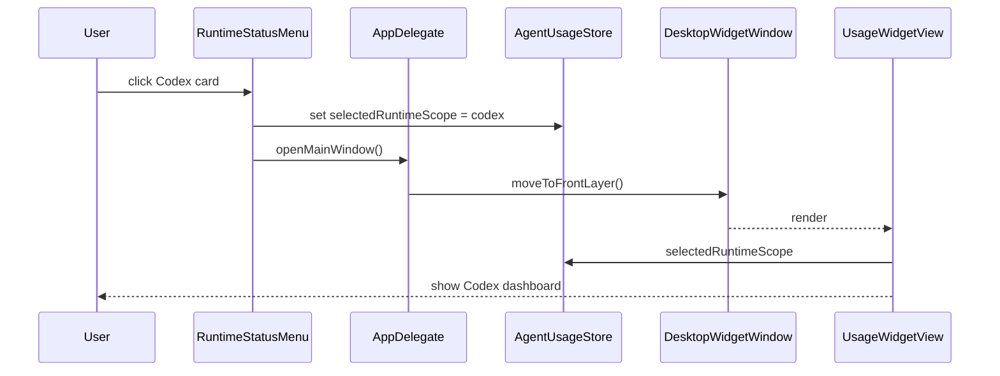
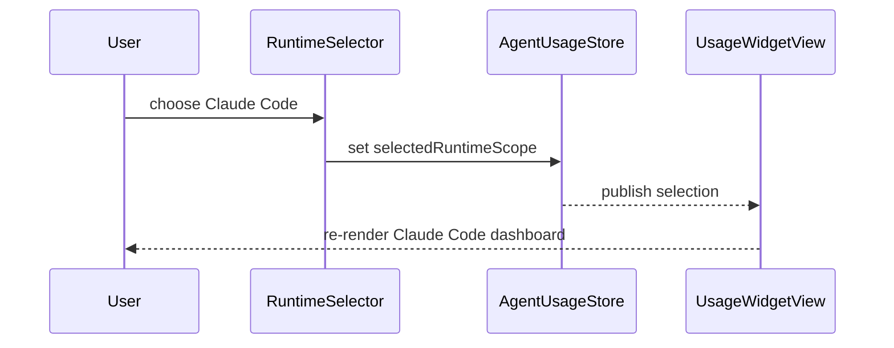
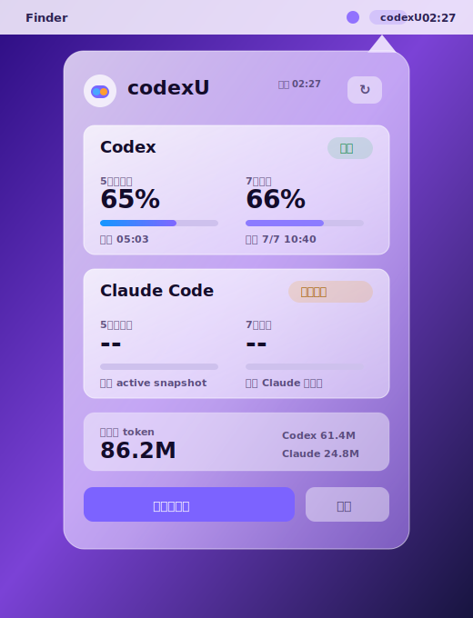
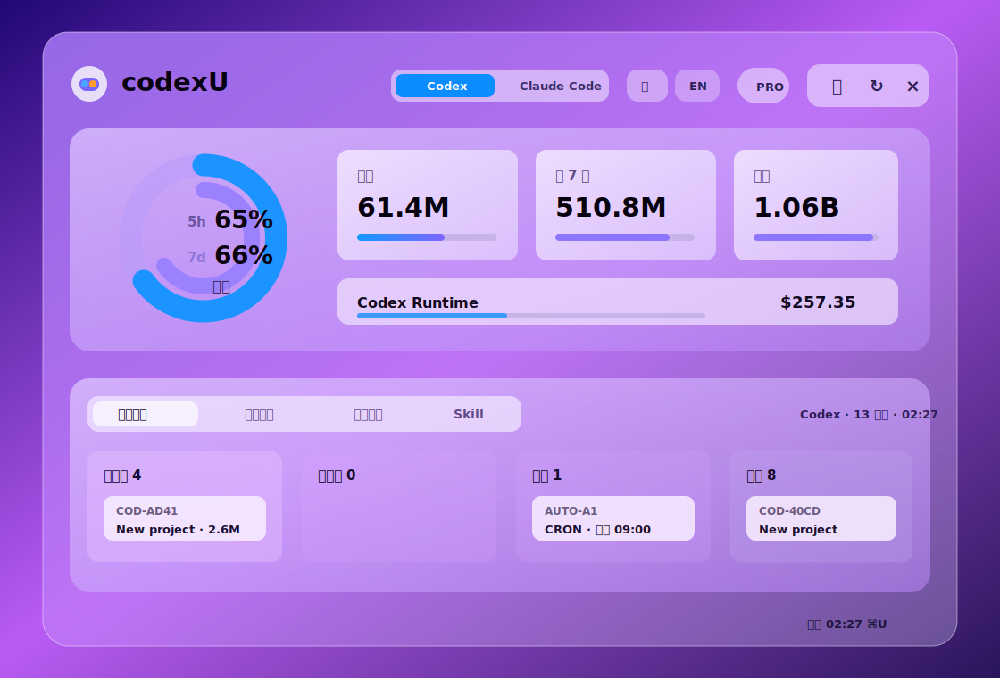

# UI 与交互设计：多 Runtime 入口与主界面切换

版本：v1.0<br>
日期：2026-07-07<br>
状态：Draft

## 1. 设计目标

本次新增 Claude Code 支持后，codexU 需要从“打开主窗口后查看 Codex”调整为“两级使用体验”：

- 状态栏菜单用于快速扫视：不打开大窗口，也能看到 Codex 与 Claude Code 的关键剩余额度和今日 token。
- 主界面用于深入分析：点击某个 Runtime 卡片后打开当前主窗口，并默认进入对应 Runtime 的详情视图。
- 主界面顶部提供全局 Runtime 开关，允许用户在 Codex 与 Claude Code 之间手动切换。

设计原则：

- 状态栏菜单只显示高频决策信息，避免承载完整仪表盘。
- Codex 与 Claude Code 独立卡片并列呈现，避免混淆额度口径。
- 聚合信息首版只用于状态栏今日总 token，不用于合并 5 小时/7 天额度百分比。
- 所有缺失和估算数据都必须明确标注，不把不可用显示为 0。

## 2. 信息架构

### 2.1 状态栏菜单

触发方式：点击 macOS 状态栏里的 codexU 图标。

菜单内容从上到下：

1. Header：`codexU`、最后刷新时间、刷新按钮。
2. Runtime 卡片区：
   - Codex 卡片。
   - Claude Code 卡片。
3. 今日汇总行：
   - 今日总 token：Codex + Claude Code 的本机 token 合计。
   - 数据口径：本机记录 / 估算。
4. Footer：
   - 打开主界面。
   - 退出。

状态栏菜单不展示：

- prompt、assistant 回复、tool arguments、tool output。
- 项目完整路径。
- 详细工具/Skill 排行。
- 趋势热力图。

### 2.2 Runtime 卡片字段

每个 Runtime 一张独立卡片。卡片字段：

| 字段 | Codex | Claude Code | 展示规则 |
| --- | --- | --- | --- |
| Runtime 名称 | Codex | Claude Code | 左上角主标题 |
| 状态 chip | Available / Local only / Unavailable | Available / Snapshot needed / Local only | 右上角小 chip |
| 5 小时剩余 | 来自 Codex app-server | 来自 Claude statusLine snapshot | 展示剩余百分比和 reset time；缺失显示 `--` |
| 7 日剩余 | 来自 Codex app-server | 来自 Claude statusLine snapshot | 展示剩余百分比和 reset time；缺失显示 `--` |
| 今日 token | Codex 本机统计 | Claude Code 本机统计 | 可汇总，统一 token 简写 |
| 数据口径 | 官方额度 + 本机统计 | active snapshot + 本机统计 | 用一行小字说明 |

### 2.3 主界面 Runtime 开关

主界面 header 下方或 header 右侧新增全局 segmented control：

- `Codex`
- `Claude Code`

首版不展示 `All` 作为主界面默认入口，避免用户误认为额度可以聚合。聚合信息只用于状态栏今日总 token 和后续可选总览面板。

切换规则：

- 手动点击 Codex：主界面所有面板切换到 Codex runtime snapshot。
- 手动点击 Claude Code：主界面所有面板切换到 Claude Code runtime snapshot。
- 切换不触发重新读取，只切换当前 store snapshot 的展示范围。
- 刷新后保持当前选择。

## 3. 关键交互流程

### 3.1 打开状态栏菜单



### 3.2 点击 Runtime 卡片进入主界面



点击 Claude Code 卡片同理，只是 `selectedRuntimeScope = claude-code`。

### 3.3 主界面手动切换 Runtime



## 4. 状态与默认值

### 4.1 默认选择

- 第一次启动：默认 Codex。
- 如果本机没有 Codex 数据但有 Claude Code 数据：默认 Claude Code。
- 如果用户从状态栏菜单点击某个卡片打开主界面：以点击的 Runtime 为准。
- 用户在主界面手动切换后：当前进程内保持选择；后续可扩展为持久化。

### 4.2 卡片状态

| 状态 | 条件 | 文案 |
| --- | --- | --- |
| Available | quota 或 token 数据至少一项可用 | 可用 / Available |
| Local only | token 可用但 quota 不可用 | 本机统计 / Local only |
| Snapshot needed | Claude Code token 可用但 active snapshot 缺失 | 需要快照 / Snapshot needed |
| Stale | Claude Code snapshot 超过 15 分钟 | 快照过期 / Stale |
| Unavailable | 没有可用本地数据 | 暂不可用 / Unavailable |

## 5. 界面效果稿

### 5.1 状态栏菜单效果



设计说明：

- 点击状态栏图标后先出现轻量 popover，而不是直接打开主窗口。
- Codex 和 Claude Code 使用两张独立卡片，卡片层级、圆角和毛玻璃材质沿用当前 codexU 卡片语言。
- 5 小时和 7 日额度在卡片内并列展示，使用数值 + 细进度条，支持缺失时显示 `--`。
- Claude Code 没有 active statusLine snapshot 时，状态 chip 使用“需要快照”，额度栏保留位置，避免刷新后布局跳动。
- 今日总 token 使用独立汇总条，明确这是可聚合指标；额度百分比不在这里聚合。
- 底部只保留“打开主界面”和“退出”两个命令，避免状态栏菜单变成完整仪表盘。

### 5.2 主界面 Runtime 开关效果



设计说明：

- 主界面保持现有桌面小组件布局，不重做视觉系统。
- Header 中新增 `Codex | Claude Code` segmented control，位置在产品名与语言/主题/刷新操作之间，属于全局数据范围控制。
- 选中 Codex 时，额度环、今日/近 7 天/累计卡片、羊毛进度、下方 dashboard 全部读取 Codex runtime snapshot。
- 从状态栏点击 Claude Code 卡片进入时，segmented control 默认切到 Claude Code，并同步切换主面板数据。
- 宽度不足时，Runtime selector 可以下沉为 header 第二行，不能挤压刷新、关闭、语言和主题控件。

### 5.3 与现有界面的对应关系

| 现有区域 | 新设计变化 | 保持不变 |
| --- | --- | --- |
| 状态栏图标 | 点击后先展示 Runtime 菜单 | 仍使用当前状态栏入口 |
| Header | 新增 Runtime segmented control | logo、产品名、语言、主题、刷新、关闭 |
| 额度环 | 根据当前 Runtime 切换数据 | 环形视觉和 reset 文案样式 |
| Token 指标卡 | 根据当前 Runtime 切换今日/近 7 天/累计 | 卡片结构、token 拆分、估算价值样式 |
| Dashboard tabs | 根据当前 Runtime 切换任务、趋势、项目、Skill | tab 顺序和卡片密度 |
| Footer | 显示当前 Runtime 的刷新时间或全局刷新时间 | `⌘U` 提示 |

## 6. 视觉规格

### 6.1 状态栏菜单尺寸

- 推荐宽度：360-400 pt。
- Runtime 卡片高度：96-112 pt。
- 卡片圆角沿用项目当前小卡片规范，不超过 8 pt，除非现有设计系统已有更高层级圆角。
- 两张卡片垂直排列，避免状态栏菜单过宽。

### 6.2 卡片布局

```text
┌────────────────────────────────────┐
│ Codex                         可用 │
│ 5小时剩余  72%       7日剩余  64%  │
│ 今日 token  1.24M                  │
│ 官方额度 + 本机统计                │
└────────────────────────────────────┘
```

Claude Code quota 不可用时：

```text
┌────────────────────────────────────┐
│ Claude Code              需要快照  │
│ 5小时剩余  --        7日剩余  --   │
│ 今日 token  860K                   │
│ 本机统计；额度需 active snapshot   │
└────────────────────────────────────┘
```

### 6.3 主界面开关位置

推荐放在 header 第二行或 header 右侧、刷新按钮左侧：

```text
codexU                         [Codex | Claude Code] [中|EN] [主题] [刷新]
```

如果宽度不足，Runtime selector 独占 header 下方一行，保持按钮不挤压。

## 7. 空状态与错误文案

| 场景 | 中文文案 | 英文文案 |
| --- | --- | --- |
| Claude Code 无 statusLine snapshot | 额度需要 Claude Code active session 快照 | Quota needs a Claude Code active session snapshot |
| Claude Code snapshot 过期 | Claude Code 快照已过期，打开 Claude Code 后刷新 | Claude Code snapshot is stale. Open Claude Code and refresh |
| Claude Code 无本机 JSONL | 暂无 Claude Code 本机用量记录 | No local Claude Code usage records yet |
| Codex app-server 不可用 | Codex 账户接口暂不可用 | Codex account API unavailable |
| 两个 Runtime 都无数据 | 暂无可展示的本机 Agent 用量 | No local agent usage records yet |

## 8. 验收标准

- 点击状态栏图标后出现状态栏菜单，不直接打开主窗口。
- 状态栏菜单同时展示 Codex 与 Claude Code 两张独立卡片。
- 每张卡片展示 5 小时剩余、7 日剩余和今日 token；缺失额度显示 `--` 和明确说明。
- 状态栏底部展示今日总 token。
- 点击 Codex 卡片打开主界面，并默认展示 Codex。
- 点击 Claude Code 卡片打开主界面，并默认展示 Claude Code。
- 主界面顶部有全局 Runtime 开关，手动切换后所有主面板同步切换。
- Runtime 切换不展示 prompt、回复正文、tool arguments 或 tool output。
